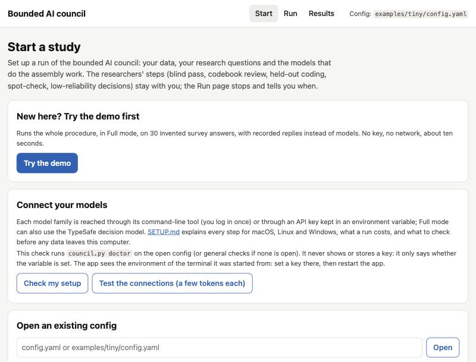
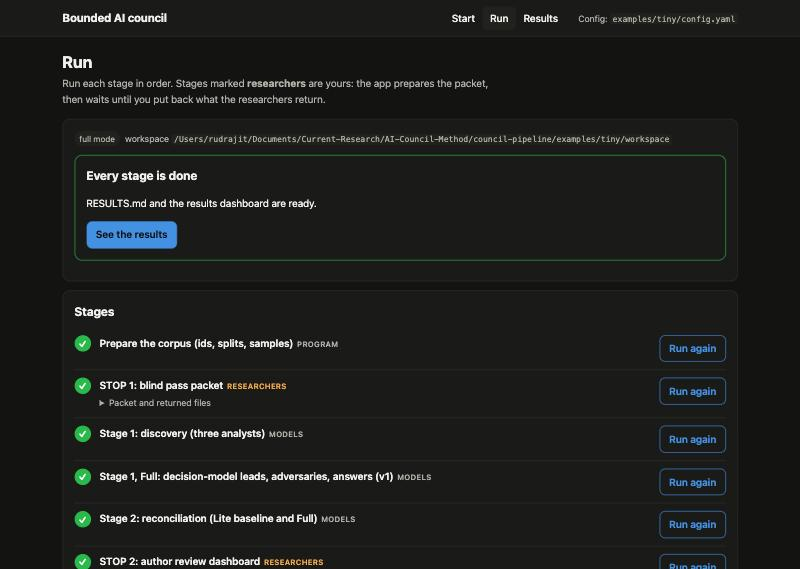
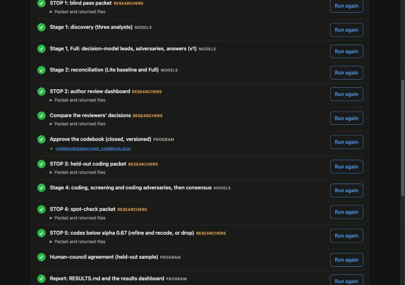
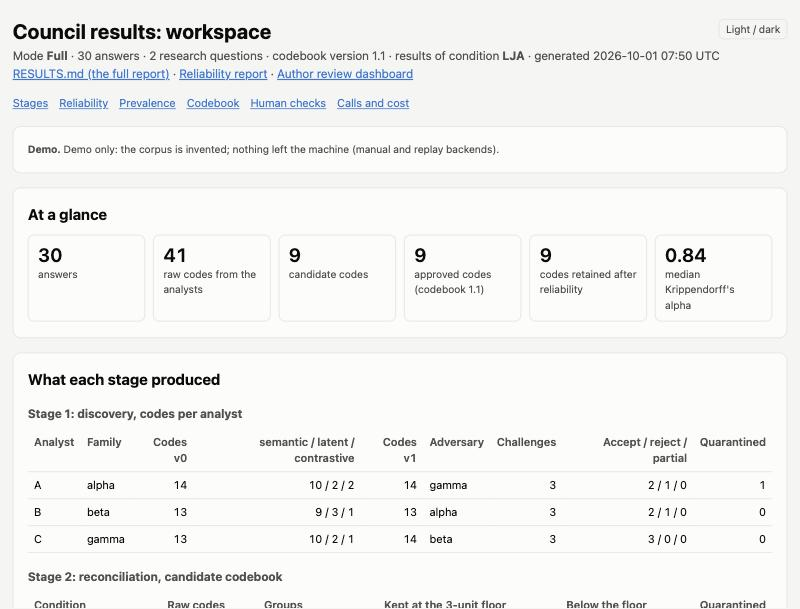
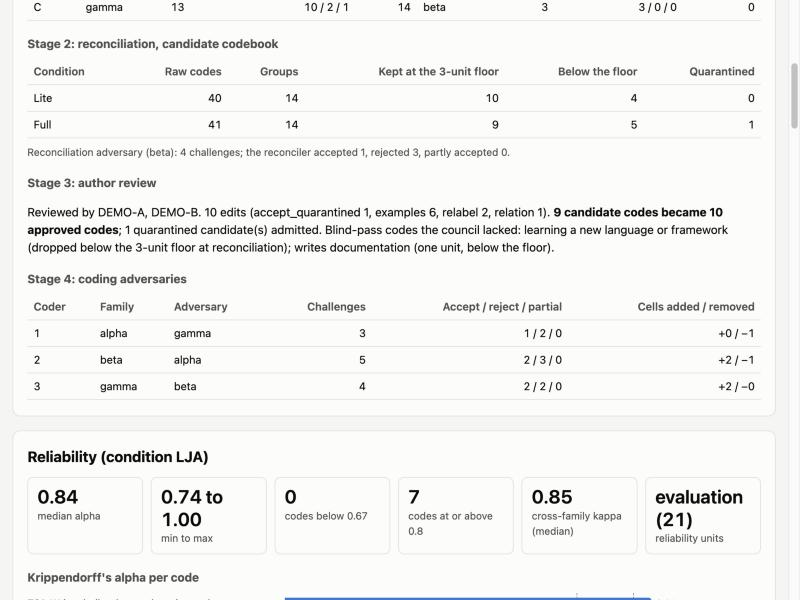
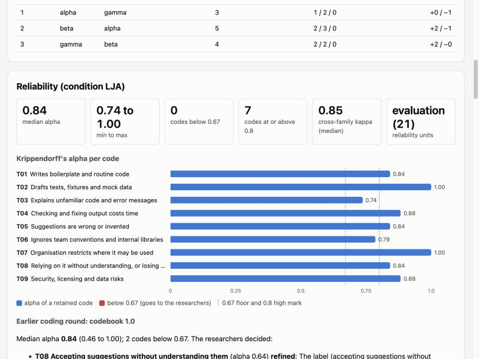
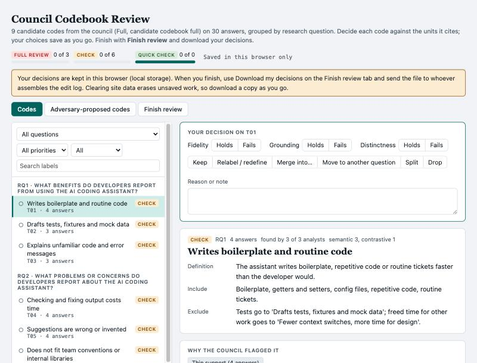

# Bounded AI council for thematic analysis

Run the bounded AI council procedure for codebook thematic analysis of qualitative data: models from
three families propose, merge and apply codes; programs check every quote and compute reliability;
researchers keep every interpretive decision.

## Quickstart 1: use it yourself (no coding agent)

You need Python 3.9 or newer and nothing else (no packages to install; `openpyxl` is optional and
adds Excel workbooks next to the CSV packets).

```bash
cd council-pipeline
python3 pipeline/app.py
```

Open the address it prints, **http://127.0.0.1:8765/**. Then:

1. **Try the demo**: the button on the Start page runs the whole procedure in Full mode on 30
   invented survey answers, with recorded replies instead of models (no key, no network, a few
   seconds). The Run page shows every stage and each stop for the researchers; the Results page
   shows the results dashboard. The same demo from a terminal: `python3 pipeline/demo.py`.
2. **Connect your models**: follow **[SETUP.md](SETUP.md)** to reach three model families (a CLI
   login or an API key in an environment variable each) and, for Full, the decision model. The
   Start page's **Connect your models** card checks what is ready and what is missing (it never
   shows a key), with the fix for each gap.
3. **Start a study**: on the Start page choose Lite or Full, upload your CSV (columns `uid,text`,
   de-identified), type your research questions, pick the three model families and how each is
   reached (CLI, API or manual), name the environment variable that holds each API key (never the
   key itself), say what may leave your computer, and save `config.yaml`.
4. **Run**: press each stage's button in order and watch its log. At each researchers' stop the
   page says what to hand to whom, links the packet or dashboard, and gives a place to put back
   what the researchers return.


## Quickstart 2: use it with a coding agent

Open Claude Code, Codex or any agent that can run shell commands in this folder and say, for example:

> Read AGENTS.md and run the offline demo (`python3 pipeline/demo.py`), then show me
> `examples/tiny/workspace/dashboard.html`.

> Read AGENTS.md. Run the council pipeline in Full mode on `data/my_corpus.csv` with these research
> questions: ... The families available are Claude (claude CLI), GPT (codex CLI) and Gemini (API key in
> GEMINI_API_KEY). Stop at each human step and tell me what to hand to whom.

`AGENTS.md` lists what the agent must ask you for, every command, the checks after each stage, where
it must stop for the researchers, and what it must report. The agent starts with
`python3 pipeline/council.py --config config.yaml doctor`, which reports which model families,
keys and logins are ready, and asks you only for what is missing; **[SETUP.md](SETUP.md)** is the
step-by-step guide for those (where to get each key, how to set it on macOS, Linux or Windows, how
to log in to the `claude` and `codex` CLIs, what a run costs). The demo is the quickest way to see
what a finished run looks like before you spend anything on model calls.

## Play with the paper's data

`examples/zhang2023/` holds the 256 Stack Overflow threads about GitHub Copilot that the paper
analysed (Zhang et al.'s 2023 corpus, rebuilt as of 18 June 2023; CC BY-SA, attribution in
`examples/zhang2023/data/ATTRIBUTION.md`) and the paper's coding results, with no model needed:

- **Open the dashboards** in a browser: `examples/zhang2023/dashboard_lite.html` and
  `examples/zhang2023/dashboard_full.html`. On the 192 evaluation threads, 72 approved codes reach a
  median Krippendorff's alpha of 0.77 in Lite and 0.87 in Full (20 and 10 codes below 0.67).
  `python3 examples/zhang2023/build_dashboards.py` rebuilds both from the result files with this
  repository's reliability code and checks every code's alpha against the paper's.
- **Run the pipeline yourself on these threads**, after SETUP.md: build the input with
  `python3 examples/zhang2023/to_pipeline_csv.py`, run `doctor`, then follow the stages with
  `--config examples/zhang2023/config.lite.yaml` (Lite, about $35 in the paper) or
  `--config examples/zhang2023/config.yaml` (Full, about $87). `examples/zhang2023/README.md` has
  the steps and explains where this pipeline differs from the experiment.

## What it looks like

The local app (`python3 pipeline/app.py`) after **Try the demo**, and the dashboards a run produces:

| | |
|---|---|
|  |  |
|  |  |
|  |  |
|  | |

## About

This repository runs the bounded AI council procedure for codebook thematic analysis of qualitative
data, as described in *A Bounded AI Council Procedure for Qualitative Analysis in Software Engineering Research*
(Choudhuri, Bird, Badea, Sarma). Models from three families do the
assembly work: three analysts independently read the corpus once per research question and propose
candidate codes with cited units and verbatim quotes (discovery); one reconciler groups the
candidates on shared evidence (reconciliation); three coders apply the approved codebook to every
unit, rationale first (coding). Programs prepare the corpus, check that every quote is an exact
substring of the unit it cites, apply the support floor, and compute consensus and per-code
reliability. Researchers keep the interpretive decisions: they open-code a blind sample before seeing
any model output, review and approve the codebook, code a held-out sample to check correctness,
spot-check rationales, and build the themes from the coded corpus.

The procedure comes in two modes. **Lite** is the five stages above with their human checks. **Full**
layers two additions onto a frozen Lite output: a cross-family adversary that challenges each
generative role (the role answers every challenge, and both versions are kept), and a calibrated
yes/no decision model (TypeSafe's Jev, or any model with the same contract) that scores the yes/no
questions of discovery and coding so that adversaries and coders spend their reasoning where it is
needed. Codes whose Krippendorff's alpha falls below 0.67 go to the researchers, who either refine
the definition and recode the corpus, or drop the code. You can run the pipeline from scripts, or point a coding agent (Claude Code, Codex, or
any agent that can run shell commands) at this folder: `AGENTS.md` tells it exactly what to do.

## Lite and Full

| Stage | Lite | Full adds |
|---|---|---|
| Preparation (program) | Stable unit ids, fixed order, optional context per unit, blocks when the corpus exceeds a context window; development / evaluation split; seeded blind-pass and held-out samples | |
| 1 Discovery | Three analysts (three families), one reading per research question (and block), three ordered passes (semantic, latent, contrastive); provenance check with up to two repair rounds and one completeness round; v0 frozen | Decision-model grounding leads (cited pairs below 0.5) and omission leads (uncited pairs at or above 0.8); one adversary per analyst from another family, critiquing three axes with seven challenge types and optional quarantined candidate codes; the analyst answers every challenge and revises (v1), which passes the same check |
| 2 Reconciliation | One reconciler per research question, merging on shared units, definitions and quotes (overlap table computed by a program); typed relations; many-to-many provenance; three-unit floor applied by a program | A reconciliation adversary from another family; the reconciler answers and revises; Lite reconciliation on v0 kept for comparison. No decision model at this stage. |
| 3 Author review (researchers) | Blind pass first; then at least two researchers review every candidate code against every cited unit (fidelity, grounding, distinctness), add examples from development units only, negotiate the edits; the codebook is closed and versioned | Reviewers also read the challenge logs and decide on quarantined candidates |
| 4 Coding | Three coders (three families) code every unit in batches of 20 to 50, rationale before codes; issue codes for data problems; `UNCOVERED` for content no code fits | Decision-model screening (codes with p at or above 0.10, never fewer than the top 5, plus a seeded 5% audit of the screened-out codes); v0 frozen; one coding adversary per coder from another family, with the decision model's disagreements as leads; the coder answers (v1). Lite coding is kept as the screening baseline. |
| 5 Reliability and consensus (program) | 2-of-3 consensus; per-code alpha, pairwise kappa, 2x2 tables, positive and negative agreement; median, min, max, number below 0.67 and at or above 0.80; survival; **codes below 0.67 go to the researchers (refine and recode, or drop)**; held-out human-council agreement; researcher spot-check | Alpha before (v0) and after (v1) adversaries, the second labelled as agreement among coder-adversary pipelines; screening recall against Lite; uncertain assignments held from prevalence until the spot-check keeps them |

## Scripted use (terminal)

Requirements: Python 3.9 or newer (standard library; `openpyxl` optional for .xlsx packets; `anthropic`
only for the `anthropic_api` backend), and access to three model families through their CLIs
(`claude`, `codex`) or APIs. Nothing here calls a model until you run `run.py`.

```bash
cp config.example.yaml config.yaml          # set mode, corpus, research questions, models
# corpus: a CSV with columns uid,text (optional: context, question, block, stratum, link), de-identified

python3 pipeline/council.py --config config.yaml doctor           # what is ready, what is missing (SETUP.md); --ping to test
python3 pipeline/council.py --config config.yaml prepare          # ids, order, splits, samples
python3 pipeline/human.py   --config config.yaml blind-pass       # HUMANS: open-code before any model output
python3 pipeline/run.py     --config config.yaml discovery        # Stage 1 (v0, checked and frozen)
python3 pipeline/run.py     --config config.yaml discovery-adversary   # Full only
python3 pipeline/run.py     --config config.yaml reconcile        # Stage 2 -> codebooks/candidate_<mode>.json
python3 pipeline/human.py   --config config.yaml review-dashboard # HUMANS: Stage 3 review
python3 pipeline/human.py   --config config.yaml review-to-edits review_A.json review_B.json
#   researchers agree codebooks/review_edits.json
python3 pipeline/council.py --config config.yaml approve          # closed, versioned codebook
python3 pipeline/human.py   --config config.yaml heldout-packet   # HUMANS: code the held-out sample
python3 pipeline/run.py     --config config.yaml code             # Stage 4 + Stage 5 consensus
python3 pipeline/human.py   --config config.yaml spot-check       # HUMANS: spot-check rationales
python3 pipeline/council.py --config config.yaml consensus        # after the spot-check decisions are back
python3 pipeline/human.py   --config config.yaml low-alpha        # HUMANS: codes below alpha 0.67: refine or drop
#   researchers return human/06_low_alpha/decisions.csv; if any code is refined:
#   python3 pipeline/council.py --config config.yaml refine; then run.py code again
python3 pipeline/council.py --config config.yaml heldout-score    # reads human/03_heldout_coding/resolved.csv
python3 pipeline/council.py --config config.yaml report           # RESULTS.md and dashboard.html
python3 pipeline/council.py --config config.yaml status           # at any time: what is done, what is next
```

Every `run.py` step skips work whose output exists, so it can be rerun after an interruption.

## How an agent drives it

The agent can drive the scripts (recommended), or, with the `manual` backend, answer prompts itself
or through sub-agents of the right families: the pipeline writes each prompt to `<workspace>/manual/`
and continues when the reply file exists (the decision model can be answered the same way). Either
way, the deterministic checks (provenance, floor, consensus, reliability) are run by the programs,
not by the agent's judgment. `council.py export-replies` records a manual run's replies so that the
`replay` backend can rerun it later with no model access; that is how the demo was made
(`examples/tiny/`). `CLAUDE.md` points Claude Code to `AGENTS.md`.

## What the researchers do

The pipeline prepares packets; it never performs these steps.

| When | Who | What | Packet | What comes back |
|---|---|---|---|---|
| Before any model output is seen | at least two researchers, alone | Blind pass: open-code a seeded sample stratified by question and block (at least 50 units, or 10% up to 200) | `human.py blind-pass` -> `human/01_blind_pass/` | each researcher's codes; later, the codes the council lacks (entered on the dashboard's Finish tab) |
| After reconciliation | at least two researchers, alone, then together | Author review of every candidate code against every cited unit; examples from development units only; negotiated edits | `human.py review-dashboard` -> `human/02_author_review/codebook_review.html` (or `review-packet` for a workbook) | each reviewer's downloaded decisions; then the agreed `codebooks/review_edits.json` |
| After approval | at least two researchers, without model assignments | Held-out coding of at least 50 evaluation units; differences resolved | `human.py heldout-packet` -> `human/03_heldout_coding/` | `resolved.csv` for `council.py heldout-score` |
| After coding | at least two researchers | Spot-check rationales: issue-coded units, uncovered content, a random sample, and (Full) decision-model disagreements | `human.py spot-check` -> `human/05_spot_check/spot_check.csv` | `human/05_spot_check/decisions.csv` |
| After consensus | the researchers, together | Every code with Krippendorff's alpha below 0.67: refine the definition and recode the corpus, or drop the code | `human.py low-alpha` -> `human/06_low_alpha/` | `human/06_low_alpha/decisions.csv` (then `council.py refine` for refined codes) |
| At the end | the researchers | Themes from the coded corpus; quotations machine-checked | `results/<cond>/consensus_retained.csv` | your write-up; `council.py check-quotes` |

## Output files (in the workspace)

```
manifest.json                  settings, corpus hash, sizes
data/                          corpus.csv, corpus.txt (what models read), splits.json, blocks
briefs/                        every rendered prompt, as sent
discovery/v0, v1, challenges, answers, jev, validation
reconciliation/<lite|full>/    input.json, overlap_table.csv, per-question plans, challenges, answers
codebooks/                     candidate_<lite|full>.json, review_edits.json, approved_codebook.json
coding/batches, L, LJ, LJA     coded batches (JSONL, rationale first); screening plan; challenges; answers
results/<cond>/                consensus.csv, consensus_retained.csv, prevalence.csv, reliability.csv,
                               reliability_report.md (incl. dropped codes), summary.json
results/                       v0_v1_diff.json, human_council_agreement.json, retention.json, costs.csv
human/                         packets for the researchers and what they return
logs/calls.jsonl, logs/raw/    every model and decision-model call; freeze.json (sha256 of frozen files)
RESULTS.md                     the run's report
dashboard.html                 the results dashboard (self-contained; open it in a browser, works offline)
archive/                       earlier coding rounds, when codes were refined after the low-alpha decision
```

## Models, reasoning and cost

Each role is assigned a family in `roles`, and each family a backend and model id in `models`
(`claude_cli`, `codex_cli`, `anthropic_api`, `openai_api` (also for OpenAI-compatible local servers),
`gemini_api`, `command`, `manual`, `replay`); `stage_models` can give one family a different model for some
stages. API keys stay in environment variables; the config names the variable, never the key
(**[SETUP.md](SETUP.md)** shows how to get and set each one).
Discovery and reconciliation run at each model's default reasoning; every other call is reduced
(`reasoning`). The decision model is configured under `decision_model` (endpoint, model, the name of
the key's environment variable, or a `command` that implements the same contract; see
`prompts/decision_model_questions.md`).

Calls scale with the corpus: discovery is 3 analysts x research questions (x blocks) whole-corpus
readings plus repairs; reconciliation is one call per question (three in Full); coding is 3 coders x
batches (twice in Full, plus 6 adversary and answer calls per batch); the decision model makes one
request per unit per analyst at discovery and one per unit at coding. `council.py cost` totals calls,
tokens and dollars per stage from the call log at the list prices you enter under `prices`; the
results dashboard shows model calls and decision-model requests apart. Calls answered by hand or
replayed have estimated token counts (about 4 characters per token). As a guide, the paper's run on
256 Stack Overflow threads cost about $14 per 100 threads in Lite and $34 in Full at 2026 list
prices; cost grows with the number of units and their length (SETUP.md, section 5).

Before anything leaves your machine: de-identify the corpus, check that participants' consent terms
allow each vendor in the config, and record both under `data_governance`.

## Repository layout

```
README.md, SETUP.md, AGENTS.md, CLAUDE.md, CHECKLIST.md, LICENSE, CITATION.cff
config.example.yaml        both modes
prompts/                   one file per role and stage; PROMPTS.md is the index
pipeline/                  app.py (local web app), demo.py (offline demo), council.py (deterministic
                           stages), run.py (model stages), models.py (backends), doctor.py (setup
                           check), reliability.py, report.py, dashboard.py, human.py (packets),
                           config.py, prompts.py, templates/review_dashboard.html
examples/tiny/             the offline demo: an invented 30-answer corpus, recorded replies, dummy
                           researcher files; its finished workspace is examples/tiny/workspace/
examples/zhang2023/        the paper's data and results: 256 Stack Overflow threads (CC BY-SA), the approved
                           codebook, Lite and Full coding results, two dashboards, configs to rerun it, scoring
```

## Citation

Please cite the paper (and this software; see `CITATION.cff`):

```bibtex
@unpublished{choudhuri2026council,
  author = {Choudhuri, Rudrajit and Bird, Christian and Badea, Carmen and Sarma, Anita},
  title  = {A Bounded {AI} Council Procedure for Qualitative Analysis in Software Engineering
            Research},
  year   = {2026},
  note   = {Manuscript under review}
}
```

Code: MIT (`LICENSE`). Prompts and documentation: CC BY-SA 4.0. The Stack Overflow threads in
`examples/zhang2023/data/` are Stack Overflow content under CC BY-SA, attributed in
`examples/zhang2023/data/ATTRIBUTION.md`.
